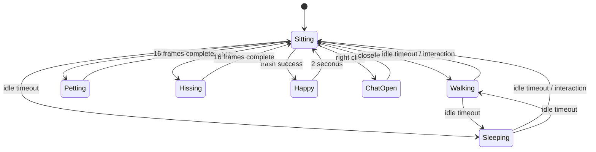

# 架构与状态转换

```mermaid
stateDiagram-v2
    [*] --> Sitting
    Sitting --> Walking: idle timeout
    Sitting --> Sleeping: idle timeout
    Walking --> Sitting: idle timeout / interaction
    Walking --> Sleeping: idle timeout
    Sleeping --> Sitting: idle timeout / interaction
    Sleeping --> Walking: idle timeout
    Sitting --> Petting: click
    Sitting --> Hissing: hiss probability
    Sitting --> Happy: trash success
    Petting --> Sitting: 16 frames complete
    Hissing --> Sitting: 16 frames complete
    Happy --> Sitting: 2 seconds
    Sitting --> ChatOpen: right click
    ChatOpen --> Sitting: close
```

状态变化只由 `src/pet/petMachine.ts` 执行。React 负责事件采集与渲染；Rust 只处理具有系统
权限或秘密的操作。文件路径不会进入聊天请求，API Key 不进入前端持久化或日志。
